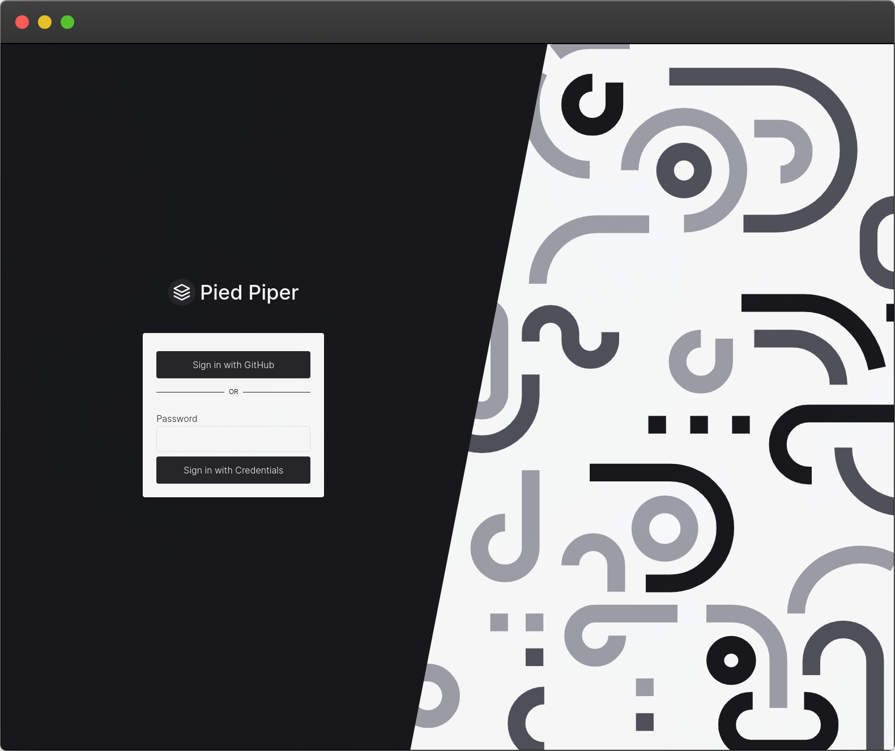

# 🔐 Example Sign-in Page

This is a custom [Auth.js v5](https://authjs.dev) sign-in page I'd once used in an internal application. I decided to open-source it in this template repository so feel free to use as you see fit! This was created with `create-next-app@14.3.0-canary` and uses `next-auth@5.0.0-beta.16`.

> [!NOTE]
> The default credentials are anything for the username and `password` for the password

## 📺 Screenshot



## 🚀 Getting Started

1. Install dependencies

```bash
pnpm install
```

2. Create your own environment variables

```bash
cp .env.local.example .env.local
```

- `AUTH_SECRET` (**required**) - `openssl rand -base64 33` or use a [a generator](https://generate-secret.vercel.app/32).
- `AUTH_GITHUB_*` (**optional**) - navigate to [GitHub > Settings > Apps](https://github.com/settings/apps) and create a new app. For a more detailed walk-through, check out the Auth.js [guide](https://authjs.dev/guides/configuring-github))

3. Start dev server

```bash
pnpm dev
```

4. Open [http://localhost:3000](http://localhost:3000) and click "Signin" in the top-left or navigate to the signin page directly ([`/auth/login`](http://localhost:3000/auth/login)).

## 🔐 Auth.js

You will find the example sign-in page under `/app/auth/login/page.tsx`.

This page has both the [`Credential` provider](https://authjs.dev/getting-started/providers/credentials) and an example OAuth provider ([`Github`](https://authjs.dev/getting-started/providers/github)) setup. More information can be found at https://authjs.dev

## 📝 License

MIT
